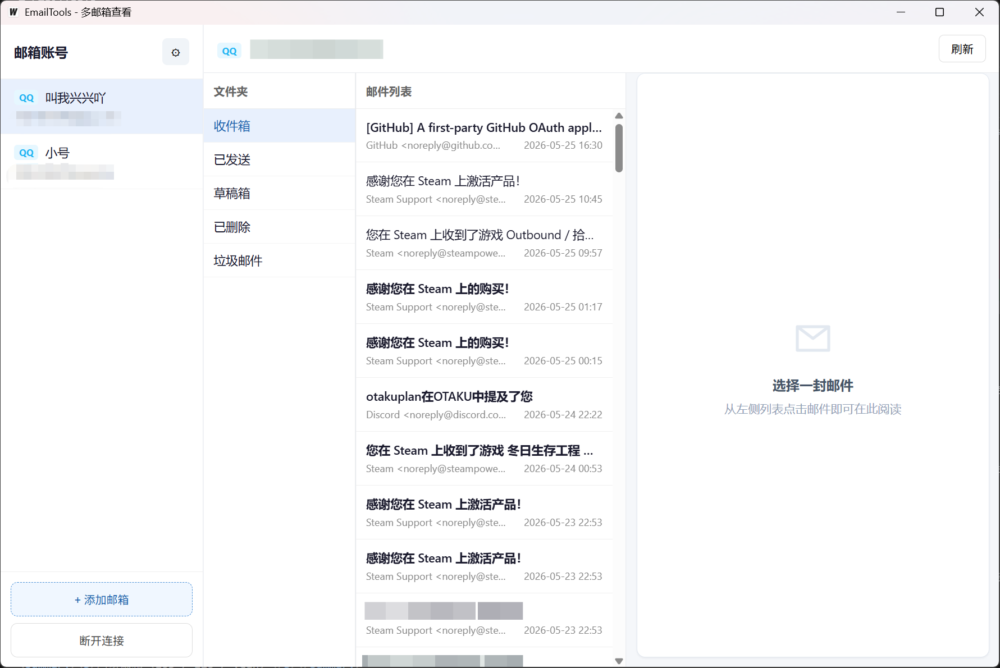
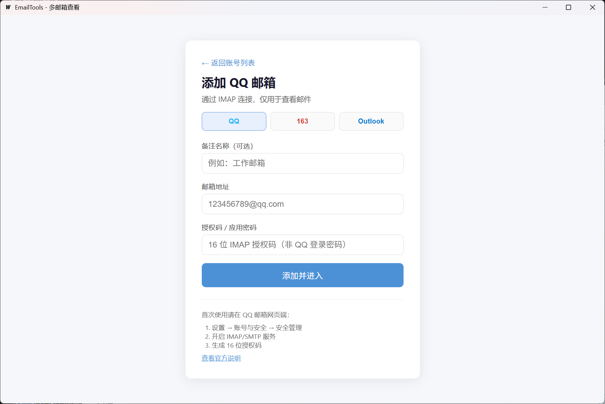

# EmailTools

**Windows 桌面多邮箱查看工具 · 只读 · 单文件 exe**

[](https://go.dev/)
[](https://wails.io/)
[](https://vuejs.org/)
[](https://www.microsoft.com/windows)
[](#许可证)

---

## 简介

**EmailTools** 是一款基于 **Go + Wails v2** 的 Windows 原生桌面应用，通过 **IMAP** 连接邮箱，专注**查看邮件**（只读，不发信、不删信）。无需安装 Python、Node 或 .NET 运行时，构建后得到单个 `EmailTools.exe`。

适合希望在本机统一查看多个邮箱、又不需要完整 Outlook/Thunderbird 客户端的场景。

### 亮点

- **多服务商**：QQ 邮箱、网易邮箱（163 / 126 / yeah）、Outlook / Hotmail
- **统一登录方式**：邮箱地址 + 授权码 / 应用密码（无需 OAuth 浏览器跳转）
- **多账号**：本地保存多个邮箱，侧栏一键切换，凭据经 **Windows DPAPI** 加密
- **接近网页的阅读体验**：HTML 正文安全过滤后展示，支持拖拽调整分栏宽度
- **离线友好**：邮件列表本地缓存，打开文件夹先显缓存再拉取最新
- **可配置刷新**：按 1–30 分钟自动刷新当前文件夹列表

### 支持的邮箱

| 类型 | 侧栏徽章 | 登录凭据 | IMAP 服务器 |
|------|----------|----------|-------------|
| QQ 邮箱 | QQ | 16 位授权码 | `imap.qq.com:993` |
| 网易邮箱 | 163 | 客户端授权密码 | `imap.163.com` / `imap.126.com` / `imap.yeah.net` |
| Outlook / Hotmail | Outlook | 微软应用密码 | `outlook.office365.com:993` |

> 部分企业 Microsoft 365 租户可能禁用 IMAP 基本认证，此类账号可能无法连接。  
> 若曾用旧版 OAuth 添加过 Outlook，请在「编辑账号」中改为**应用密码**。

---

## 截图





## 快速开始

### 下载运行（推荐）

1. 从 [Releases](https://github.com/YOUR_USERNAME/EmailTools/releases) 下载 `EmailTools.exe`（或本地构建见下文）
2. 在对应邮箱网页端开启 IMAP，并生成授权码 / 应用密码（见下方说明）
3. 启动程序 → 选择邮箱类型 → 填写邮箱与凭据 → 进入主界面

### 使用前准备

<details>
<summary><b>QQ 邮箱</b></summary>

1. 打开 [QQ 邮箱](https://mail.qq.com/) → **设置 → 账号与安全 → 安全管理**
2. 开启 **IMAP/SMTP**，生成 **16 位授权码**（不是 QQ 登录密码）

官方说明：<https://help.mail.qq.com/detail/0/985>

</details>

<details>
<summary><b>网易邮箱（163 / 126 / yeah）</b></summary>

1. 网页邮箱 → **设置 → POP3/SMTP/IMAP**
2. 开启 IMAP/SMTP，设置 **客户端授权密码**

帮助：<https://help.mail.163.com/faqDetail.do?code=d6af8ee8f1f8e0b0>

</details>

<details>
<summary><b>Outlook / Hotmail</b></summary>

1. 在 Outlook 网页端开启 **IMAP**
2. 若账户开启双重验证，在 [微软账户安全中心](https://account.live.com/proofs/manage) 创建 **应用密码**
3. 在 EmailTools 中选择 Outlook，填写邮箱与应用密码（**不是**登录密码）

说明：[使用应用密码登录](https://support.microsoft.com/account-billing/using-app-passwords-with-apps-that-don-t-support-two-step-verification-5896ed9b-4263-6812-ef18-520f4cf8f57c)

</details>

---

## 功能

| 功能 | 说明 |
|------|------|
| 多账号管理 | 添加 / 切换 / 编辑 / 删除；启动时自动连接上次活动账号 |
| 邮件浏览 | 文件夹（中文显示名）、列表、详情；未读样式 |
| HTML 正文 | `bluemonday` 过滤 + WebView2 隔离展示；无 HTML 时显示纯文本 |
| 附件信息 | 展示文件名、类型、大小（**不支持下载**） |
| 列表缓存 | 按账号 + 文件夹缓存；打开时先缓存后拉取；超 7 天自动清理 |
| 定时刷新 | 设置 1–30 分钟间隔，静默刷新当前文件夹 |
| 分栏拖拽 | 调整账号栏、文件夹、列表、详情宽度 |
| 链接打开 | 邮件内链接可选系统浏览器或应用内打开 |
| 连接保活 | 每 9 分钟 IMAP NOOP；断线自动重连一次 |

**当前不支持**：发信、删信、移动邮件、附件下载、系统托盘通知、全文搜索。

---

## 系统要求

- Windows 10 / 11（64 位）
- [WebView2 运行时](https://developer.microsoft.com/microsoft-edge/webview2/)（多数系统已预装）

---

## 从源码构建

**依赖**：Go 1.23+、Node.js、 [Wails CLI v2](https://wails.io/docs/gettingstarted/installation)

```powershell
# 安装 Wails CLI（首次）
go install github.com/wailsapp/wails/v2/cmd/wails@latest

# 开发模式（热重载）
wails dev

# 发布构建
wails build -platform windows/amd64
```

产物：`build/bin/EmailTools.exe`

> 仓库已忽略 `build/bin`、`frontend/dist`、`node_modules`。首次 clone 后需执行 `wails build` 或 `wails dev` 生成前端资源。

---

## 本地数据

| 用途 | 路径 |
|------|------|
| 账号（DPAPI 加密） | `%AppData%\EmailTools\accounts.json` |
| 用户设置 | `%AppData%\EmailTools\settings.json` |
| 列表缓存 | `%AppData%\EmailTools\cache\messages\` |

清空缓存不会删除已保存的账号。

---

## 技术栈

- [Wails v2](https://wails.io/) + [Vue 3](https://vuejs.org/)
- [go-imap](https://github.com/emersion/go-imap) — IMAP 协议
- [bluemonday](https://github.com/microcosm-cc/bluemonday) — HTML 安全过滤
- Windows DPAPI — 凭据加密

```
EmailTools/
├── main.go
├── internal/
│   ├── app/           # Wails API
│   ├── provider/      # QQ / 163 / Outlook
│   ├── imap/          # IMAP 连接与保活
│   ├── mime/          # 邮件解析
│   ├── credential/    # 多账号 DPAPI
│   ├── settings/
│   └── cache/
└── frontend/          # Vue 3 UI
```

---

## 许可证

本项目仅供学习与交流使用。使用各邮箱服务须遵守对应服务商的服务条款。  
如需开源协议，可自行添加 `LICENSE` 文件（例如 MIT）。

---

## 免责声明

本软件与 QQ、网易、Microsoft 等服务商无关联。请妥善保管授权码与应用密码，不要提交到公开仓库。
